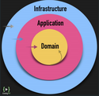
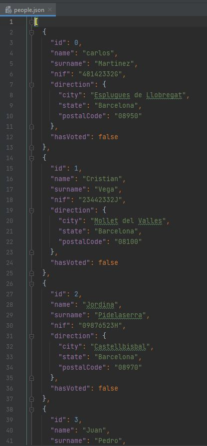
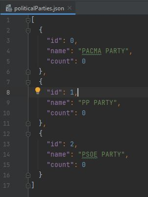
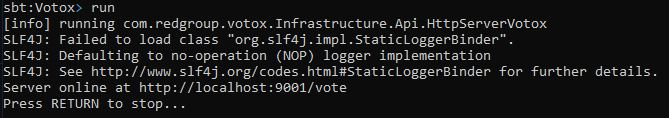
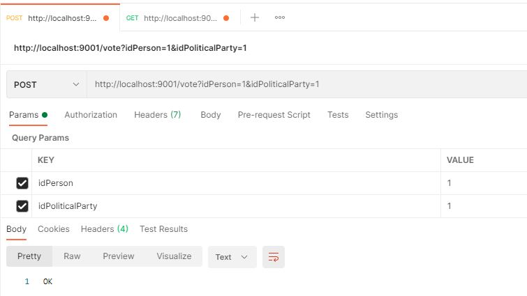
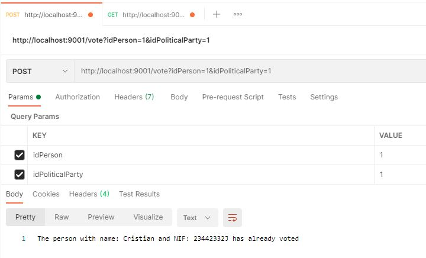
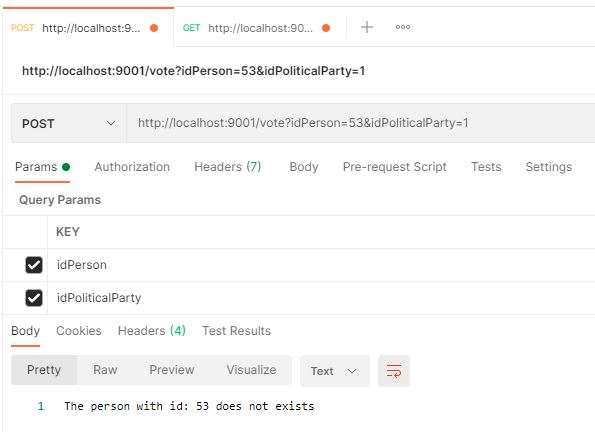
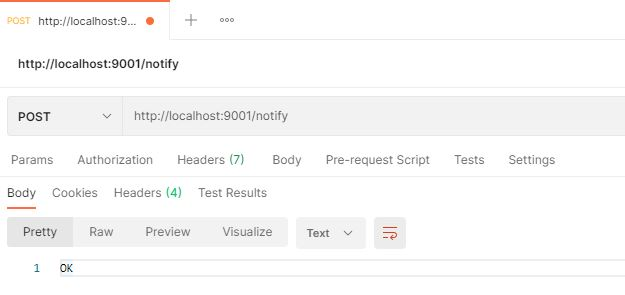
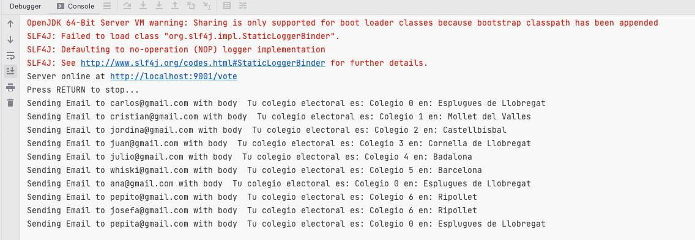

# Urnax application 📳🎮

# LaSalle – Programming paradigms 🎓🏭

# Content 📇

*   1. <a href="#1-main-idea-"> Main Idea </a>
*   2. <a href="#2-requirements-%EF%B8%8F"> Requirements </a>
*   3. <a href="#3-folders-and-files-"> Folders and files </a>
*   4. <a href="#4-configuration-%EF%B8%8F">  Configuration </a>
*   5. <a href="#5-run-in-local-"> Run in local </a>
*   6. <a href="#6-endpoints"> Endpoints </a>

# 1. Main idea 🤔💭

A company dedicated to electronic voting has been given the green light by the ministry to create and deploy an
electronic voting software for the next municipal elections.

They have asked for a software solution (Scala) that will help them to validate the identity of the voters and of course
they can only vote once. The software will also send on day of voting a message to the registered users giving the
location of the polling station where they are assigned to vote.

# 2. Requirements ✔️

The requirements for this application are:

* Correct implementation of the object-oriented paradigm, making proper use of the different entities that exist in the
  language of the different entities that exist in the language: object, class, case, class, etc.
* The use "whenever possible" of expressions in the code.
* Typical functional programming figures, such as:
    - HOF (Higher Order Functions)
    - Option (tipos nullables)
    - Pattern matching
    - Funciones anónimas
    - Programación asíncrona
    - Comentarios en código
    - Estructura limpia y legibilidad

# 3. Folders and files 📁
 * **Infraestructura Layer**
    * **Application Layer**
    * **Domain Layer**
      *  **Aggregator**: Group of domain objects (entities and VOs) that can be treated as a single unit.
      *  **Entities**: Unique identity Mutable .
      *  **Domain Services**: Encapsulate application behaviors not belonging to any entity. Input and output of domain objects.
      *  **Value Objects**: Objects of our application.

**DDD Layers:**  

<p align="center">
 
</p>

**Database/Local Store via JSON:**  


In order to have a list of voters and parties we use the JSON data structure as a database.
<p align="center">
 
</p>
<p align="center">
 
</p>

# 4. Configuration ⚙️

## Requirements:

- First, make sure you have the Java 8 JDK (or Java 11 JDK) installed. ```java -version(Make sure you have version 1.8 or 11.)```
- Need SBT to install all dependecies. https://www.scala-sbt.org/download.html
- Then, install Scala: https://www.scala-lang.org/download/


# 5. Run in local 🏠

* Go to root path URNAX where you can find the build.sbt file and run the following command on CMD:
```sbt```  


* Inside sbt write the command "run":
```sbt:Votox> run ``` 


<p align="center">
 
</p>


Now application is running on http://localhost:9001

# 6. Endpoints:

## POST Vote:
Route ('http://localhost:9001/vote')
* idPerson: Person identifier. (Required)
* idPoliticalParty: Political party identifier. (Required)  

<b>Case vote successful:<b/>✔️  
    


    </br>
<b>Case idPerson already voted (hasVoted = true):<b/>❌  
</br>

    </br>
<b>Case idPerson not exist on the person.json list:<b/>❌  
   </br> 




## Get score:
Route ('http://localhost:9001/score')  

<b>Return all political parties scores (vote counts):<b/>✔️  
    
## Send emails:
Route ('http://localhost:9001/notify')  

<b>Send emails to all person on people.json with the needed information to know where to go to vote:<b/>✔️  



## Email Service:

<b>Send email with the information needed to vote (school and town) for every person on the list.<b/>✔️  
    



